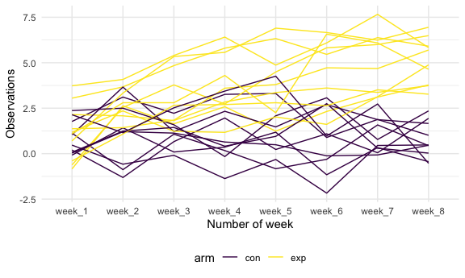

Homework 5
================
Gauri Bhatkhande

## Problem 1

``` r
homicide_df = 
  read_csv("Data/homicide-data.csv") %>%
  mutate(
    city_state = str_c(city, state, sep = "_"),
    resolved = case_when(
      disposition == "Closed without arrest" ~ "unsolved",
      disposition == "Open/No arrest"        ~ "unsolved",
      disposition ==  "Closed by arrest"      ~ "solved",
    )
  ) %>%
  select(city_state, resolved) %>%
  filter(city_state != "Tulsa_AL")
```

    ## Parsed with column specification:
    ## cols(
    ##   uid = col_character(),
    ##   reported_date = col_double(),
    ##   victim_last = col_character(),
    ##   victim_first = col_character(),
    ##   victim_race = col_character(),
    ##   victim_age = col_character(),
    ##   victim_sex = col_character(),
    ##   city = col_character(),
    ##   state = col_character(),
    ##   lat = col_double(),
    ##   lon = col_double(),
    ##   disposition = col_character()
    ## )

Looking at this a bit

``` r
aggregate_df = 
  homicide_df %>% 
  group_by(city_state) %>% 
  summarize (
    hom_total = n(),
    hom_unsolved = sum(resolved == "unsolved")
  )
```

    ## `summarise()` ungrouping output (override with `.groups` argument)

Can I do a prop test for a single city?

``` r
prop.test(
  aggregate_df %>% filter( city_state == "Baltimore_MD") %>% pull(hom_unsolved),
  aggregate_df %>% filter( city_state == "Baltimore_MD") %>% pull(hom_total)) %>% 
  broom::tidy()
```

    ## # A tibble: 1 x 8
    ##   estimate statistic  p.value parameter conf.low conf.high method    alternative
    ##      <dbl>     <dbl>    <dbl>     <int>    <dbl>     <dbl> <chr>     <chr>      
    ## 1    0.646      239. 6.46e-54         1    0.628     0.663 1-sample… two.sided

Try to iterate

``` r
results_df = 
  aggregate_df %>%
  mutate(
    prop_tests = map2(.x = hom_unsolved, .y = hom_total, ~prop.test(x = .x, n = .y)),
    tidy_tests = map(.x = prop_tests, ~broom::tidy(.x))
  ) %>% 
  select(-prop_tests) %>% 
  unnest(tidy_tests) %>%
  select(city_state, estimate, conf.low, conf.high)
```

``` r
results_df %>% 
  mutate(city_state = fct_reorder(city_state, estimate)) %>% 
  ggplot(aes(x = city_state, y = estimate)) +
  geom_point() +
  geom_errorbar(aes(ymin = conf.low, ymax = conf.high)) +
  theme(axis.text.x= element_text(angle = 90, vjust = 0.5, hjust = 1 ))
```


``` r
homicide_df = 
  read_csv("Data/homicide-data.csv") %>%
  mutate(
    city_state = str_c(city, state, sep = "_"),
    resolved = case_when(
      disposition == "Closed without arrest" ~ "unsolved",
      disposition == "Open/No arrest"        ~ "unsolved",
      disposition ==  "Closed by arrest"      ~ "solved",
    )
  ) %>%
  select(city_state, resolved) %>%
  filter(city_state != "Tulsa_AL") %>% 
  nest(data = resolved)
```

    ## Parsed with column specification:
    ## cols(
    ##   uid = col_character(),
    ##   reported_date = col_double(),
    ##   victim_last = col_character(),
    ##   victim_first = col_character(),
    ##   victim_race = col_character(),
    ##   victim_age = col_character(),
    ##   victim_sex = col_character(),
    ##   city = col_character(),
    ##   state = col_character(),
    ##   lat = col_double(),
    ##   lon = col_double(),
    ##   disposition = col_character()
    ## )

## Problem 2

*Creating a tidy dataframe:*

``` r
files = list.files(path = "Prob2data", full.names = TRUE)

long_study = files  %>%
  set_names() %>%
  map_dfr(read_csv, .id = "file_name")%>%
  separate(file_name, c("dir","arm","subject_id","ext"))%>%
  select(-c(dir,ext))%>%
  pivot_longer(week_1:week_8, 
               names_to= "week_number", 
               values_to="observation") 
```

    ## Parsed with column specification:
    ## cols(
    ##   week_1 = col_double(),
    ##   week_2 = col_double(),
    ##   week_3 = col_double(),
    ##   week_4 = col_double(),
    ##   week_5 = col_double(),
    ##   week_6 = col_double(),
    ##   week_7 = col_double(),
    ##   week_8 = col_double()
    ## )
    ## Parsed with column specification:
    ## cols(
    ##   week_1 = col_double(),
    ##   week_2 = col_double(),
    ##   week_3 = col_double(),
    ##   week_4 = col_double(),
    ##   week_5 = col_double(),
    ##   week_6 = col_double(),
    ##   week_7 = col_double(),
    ##   week_8 = col_double()
    ## )
    ## Parsed with column specification:
    ## cols(
    ##   week_1 = col_double(),
    ##   week_2 = col_double(),
    ##   week_3 = col_double(),
    ##   week_4 = col_double(),
    ##   week_5 = col_double(),
    ##   week_6 = col_double(),
    ##   week_7 = col_double(),
    ##   week_8 = col_double()
    ## )
    ## Parsed with column specification:
    ## cols(
    ##   week_1 = col_double(),
    ##   week_2 = col_double(),
    ##   week_3 = col_double(),
    ##   week_4 = col_double(),
    ##   week_5 = col_double(),
    ##   week_6 = col_double(),
    ##   week_7 = col_double(),
    ##   week_8 = col_double()
    ## )
    ## Parsed with column specification:
    ## cols(
    ##   week_1 = col_double(),
    ##   week_2 = col_double(),
    ##   week_3 = col_double(),
    ##   week_4 = col_double(),
    ##   week_5 = col_double(),
    ##   week_6 = col_double(),
    ##   week_7 = col_double(),
    ##   week_8 = col_double()
    ## )
    ## Parsed with column specification:
    ## cols(
    ##   week_1 = col_double(),
    ##   week_2 = col_double(),
    ##   week_3 = col_double(),
    ##   week_4 = col_double(),
    ##   week_5 = col_double(),
    ##   week_6 = col_double(),
    ##   week_7 = col_double(),
    ##   week_8 = col_double()
    ## )
    ## Parsed with column specification:
    ## cols(
    ##   week_1 = col_double(),
    ##   week_2 = col_double(),
    ##   week_3 = col_double(),
    ##   week_4 = col_double(),
    ##   week_5 = col_double(),
    ##   week_6 = col_double(),
    ##   week_7 = col_double(),
    ##   week_8 = col_double()
    ## )
    ## Parsed with column specification:
    ## cols(
    ##   week_1 = col_double(),
    ##   week_2 = col_double(),
    ##   week_3 = col_double(),
    ##   week_4 = col_double(),
    ##   week_5 = col_double(),
    ##   week_6 = col_double(),
    ##   week_7 = col_double(),
    ##   week_8 = col_double()
    ## )
    ## Parsed with column specification:
    ## cols(
    ##   week_1 = col_double(),
    ##   week_2 = col_double(),
    ##   week_3 = col_double(),
    ##   week_4 = col_double(),
    ##   week_5 = col_double(),
    ##   week_6 = col_double(),
    ##   week_7 = col_double(),
    ##   week_8 = col_double()
    ## )
    ## Parsed with column specification:
    ## cols(
    ##   week_1 = col_double(),
    ##   week_2 = col_double(),
    ##   week_3 = col_double(),
    ##   week_4 = col_double(),
    ##   week_5 = col_double(),
    ##   week_6 = col_double(),
    ##   week_7 = col_double(),
    ##   week_8 = col_double()
    ## )
    ## Parsed with column specification:
    ## cols(
    ##   week_1 = col_double(),
    ##   week_2 = col_double(),
    ##   week_3 = col_double(),
    ##   week_4 = col_double(),
    ##   week_5 = col_double(),
    ##   week_6 = col_double(),
    ##   week_7 = col_double(),
    ##   week_8 = col_double()
    ## )
    ## Parsed with column specification:
    ## cols(
    ##   week_1 = col_double(),
    ##   week_2 = col_double(),
    ##   week_3 = col_double(),
    ##   week_4 = col_double(),
    ##   week_5 = col_double(),
    ##   week_6 = col_double(),
    ##   week_7 = col_double(),
    ##   week_8 = col_double()
    ## )
    ## Parsed with column specification:
    ## cols(
    ##   week_1 = col_double(),
    ##   week_2 = col_double(),
    ##   week_3 = col_double(),
    ##   week_4 = col_double(),
    ##   week_5 = col_double(),
    ##   week_6 = col_double(),
    ##   week_7 = col_double(),
    ##   week_8 = col_double()
    ## )
    ## Parsed with column specification:
    ## cols(
    ##   week_1 = col_double(),
    ##   week_2 = col_double(),
    ##   week_3 = col_double(),
    ##   week_4 = col_double(),
    ##   week_5 = col_double(),
    ##   week_6 = col_double(),
    ##   week_7 = col_double(),
    ##   week_8 = col_double()
    ## )
    ## Parsed with column specification:
    ## cols(
    ##   week_1 = col_double(),
    ##   week_2 = col_double(),
    ##   week_3 = col_double(),
    ##   week_4 = col_double(),
    ##   week_5 = col_double(),
    ##   week_6 = col_double(),
    ##   week_7 = col_double(),
    ##   week_8 = col_double()
    ## )
    ## Parsed with column specification:
    ## cols(
    ##   week_1 = col_double(),
    ##   week_2 = col_double(),
    ##   week_3 = col_double(),
    ##   week_4 = col_double(),
    ##   week_5 = col_double(),
    ##   week_6 = col_double(),
    ##   week_7 = col_double(),
    ##   week_8 = col_double()
    ## )
    ## Parsed with column specification:
    ## cols(
    ##   week_1 = col_double(),
    ##   week_2 = col_double(),
    ##   week_3 = col_double(),
    ##   week_4 = col_double(),
    ##   week_5 = col_double(),
    ##   week_6 = col_double(),
    ##   week_7 = col_double(),
    ##   week_8 = col_double()
    ## )
    ## Parsed with column specification:
    ## cols(
    ##   week_1 = col_double(),
    ##   week_2 = col_double(),
    ##   week_3 = col_double(),
    ##   week_4 = col_double(),
    ##   week_5 = col_double(),
    ##   week_6 = col_double(),
    ##   week_7 = col_double(),
    ##   week_8 = col_double()
    ## )
    ## Parsed with column specification:
    ## cols(
    ##   week_1 = col_double(),
    ##   week_2 = col_double(),
    ##   week_3 = col_double(),
    ##   week_4 = col_double(),
    ##   week_5 = col_double(),
    ##   week_6 = col_double(),
    ##   week_7 = col_double(),
    ##   week_8 = col_double()
    ## )
    ## Parsed with column specification:
    ## cols(
    ##   week_1 = col_double(),
    ##   week_2 = col_double(),
    ##   week_3 = col_double(),
    ##   week_4 = col_double(),
    ##   week_5 = col_double(),
    ##   week_6 = col_double(),
    ##   week_7 = col_double(),
    ##   week_8 = col_double()
    ## )

``` r
long_study
```

    ## # A tibble: 160 x 4
    ##    arm   subject_id week_number observation
    ##    <chr> <chr>      <chr>             <dbl>
    ##  1 con   01         week_1             0.2 
    ##  2 con   01         week_2            -1.31
    ##  3 con   01         week_3             0.66
    ##  4 con   01         week_4             1.96
    ##  5 con   01         week_5             0.23
    ##  6 con   01         week_6             1.09
    ##  7 con   01         week_7             0.05
    ##  8 con   01         week_8             1.94
    ##  9 con   02         week_1             1.13
    ## 10 con   02         week_2            -0.88
    ## # … with 150 more rows

*Making a spaghetti plot:*

``` r
long_study %>%
ggplot( aes(week_number, observation, group = paste(subject_id, arm), color = arm)) + geom_line() +
labs (
  x = "Number of week",
  y = "Observations"
)
```


Observations appear to be constant or in the same range of values for
the control arm while the observations seem to be increasing on the
experimental arm over time.

## Problem 3

*Creating a function so that a sample of size 30 is taken and then the
ttest is run on it to get the estimate and p values. Also used tidy from
broom to get estimate and p value from the messy output.*

``` r
library(broom)
set.seed(1)

sim_normal_ttest = function(n =30, mu, sigma = 5) {
  
  sim_data = tibble(
    x = rnorm(n, mean = mu, sd = sigma)
  )
  
  sim_data %>% 
  t.test()%>%
  tidy() %>%
  select (c(estimate, p.value))
  
}
```

*Running the above function 5000 times:*

``` r
sim_results = 
  rerun(5000, sim_normal_ttest(30, 0, 5)) %>% 
  bind_rows()
```

*Running the above function 5000 times for every different mu:*

``` r
sim_results = 
  tibble(mu = c(0,1,2,3,4,5,6)) %>% 
  mutate(
    output_lists = map(.x = mu, ~rerun(5000, sim_normal_ttest(mu = .x))),
    estimate_dfs = map(output_lists, bind_rows)) %>% 
  select(-output_lists) %>% 
  unnest(estimate_dfs)
```

*Plotting power versus true value of mu:*

``` r
sim_results %>%
mutate(
  conclusion =case_when(
    p.value<.05 ~ "reject null",
    p.value>=.05 ~ "failed to reject null"
))%>%
  group_by(mu)%>%
  summarize(
  power = sum(conclusion=="reject null")/n()
)%>%
ggplot(
  aes(x = factor(mu), y = power )) + 
  geom_point() + 
  geom_line(group =1) +
  labs(title = "Power versus true value of mean",
       x = "True values of mean",
       y = "Power")
```

    ## `summarise()` ungrouping output (override with `.groups` argument)


*Association between effect size and power:* As the effect size
increases (difference between true mu and 0), the power goes on
increasing. This suggests that the power is directly proportional to the
effect size when all else (alpha and sample size) is constant.

*Making a plot of average estimate of mu versus true value of mu and a
second plot the average estimate of mu only in samples for which the
null was rejected versus the true value of mu on the x axis.*

``` r
sim_results %>%
mutate(
  conclusion =case_when(
    p.value<.05 ~ "reject null",
    p.value>=.05 ~ "failed to reject null"
))%>%
group_by(mu)%>%
summarize(
  avg = mean(estimate),
  avg_null = mean(estimate[conclusion=="reject null"])
)%>%
ggplot(aes(x = factor(mu) )) + 
  geom_point(aes(y= avg, color = "red"))  + 
  geom_line(aes(y = avg, color = "red"), group = 1) + 
  
  geom_point(aes(y= avg_null,  color = "blue")) +
  geom_line(aes(y=avg_null,  color = "blue"), group =1) + 
  labs(title = "Overlay plot of average estimates versus true values of mean",
       x = "True values of mean", 
       y = "Average estimates")+
  scale_color_discrete(name = "Avg estimates", labels = c("Average estimates of mu where null was rejected", "Average estimates of mu for all"))+
  theme(legend.position="bottom")
```

    ## `summarise()` ungrouping output (override with `.groups` argument)


Th red plot shows Average estimate of mu only for samples where null was
rejected. The blue plot shows average estimate of mu for all samples

The sample average estimate mu only in tests for which null was rejected
is not equal to the true value of mu on the x axis for the means 0 to 3.
From 4 onwards, the average estimate mu only in tests for which null was
rejected is equal to the true value of mu on the x axis. This is
because, when power increases, the deviation of the estimates from true
mean reduces. The power as we saw was increasing with increasing mu
(i.e. increasing effect size).
